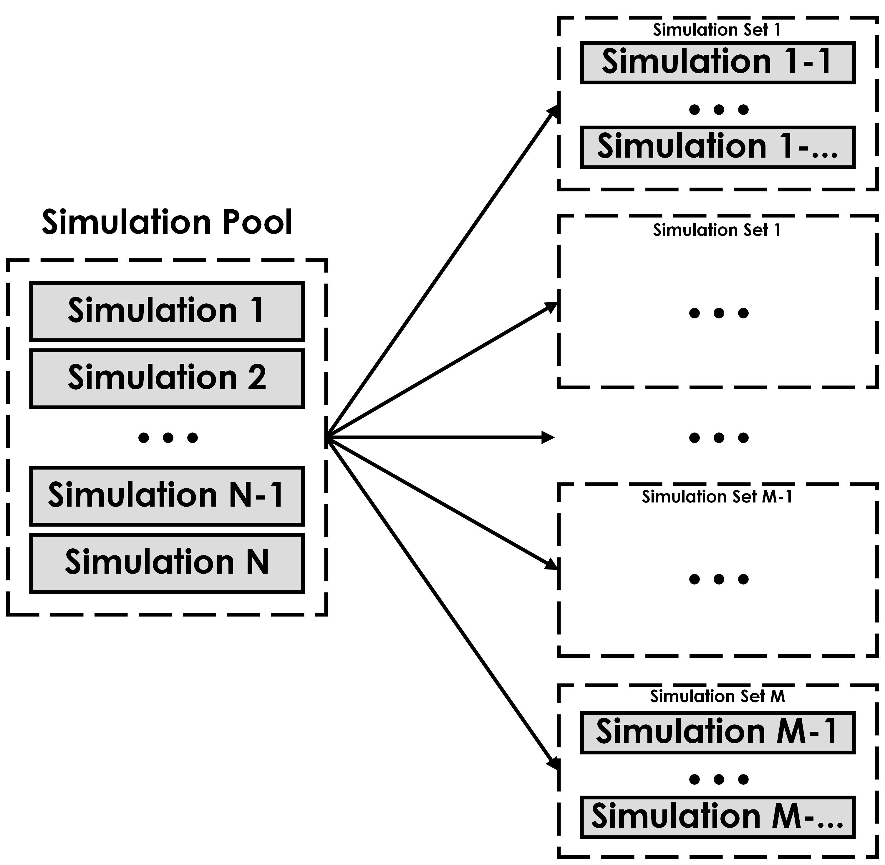

Simulation Pool
===============

Just as components are combined to form a simulation, multiple simulations are merged to form a simulation pool. 
The simulation pool encompasses all the simulations to be conducted.

Once the simulation pool is defined, VLMP distributes the simulations into different sets, 
each of which can be run in parallel on a single GPU. 
This distribution process is highly customizable, allowing users to specify splitting criteria based on various factors 
such as the size of the simulations (determined by the number of particles), the specific components involved, 
or any other relevant parameters. For example, if we distribute the simulation pool according to some size, N, 
some particle number, we ensure that every simulation set has N particles at most. 
VLMP provides several built-in options for distributing simulations, but users can also incorporate their own.

Figure ":ref:`fig_vlmpSimulationPoolDistr`" illustrates the simulation pool and its distribution into simulation sets. 
The simulation pool contains all the individual simulations. 
These simulations are then partitioned into distinct simulation sets, each of which can be executed in parallel. 
Within each simulationSet, the underlying simulations are run simultaneously on a single GPU.

.. _fig_vlmpSimulationPoolDistr:

    Simulation Pool Distribution

    Simulation pool and its distribution into simulation sets for parallel execution. 
    The simulation pool contains all the individual simulations, which are partitioned into simulation sets. 
    Each simulation set can be executed in parallel. 
    In this image in particular N simulations are distributed across M simulations sets.

In VLMP, the concept of a simulation pool is implemented using a simple Python list, where each element of the list represents an individual simulation. 
This list is then processed by VLMP, and the simulations are distributed into different groups based on the specified criteria.
