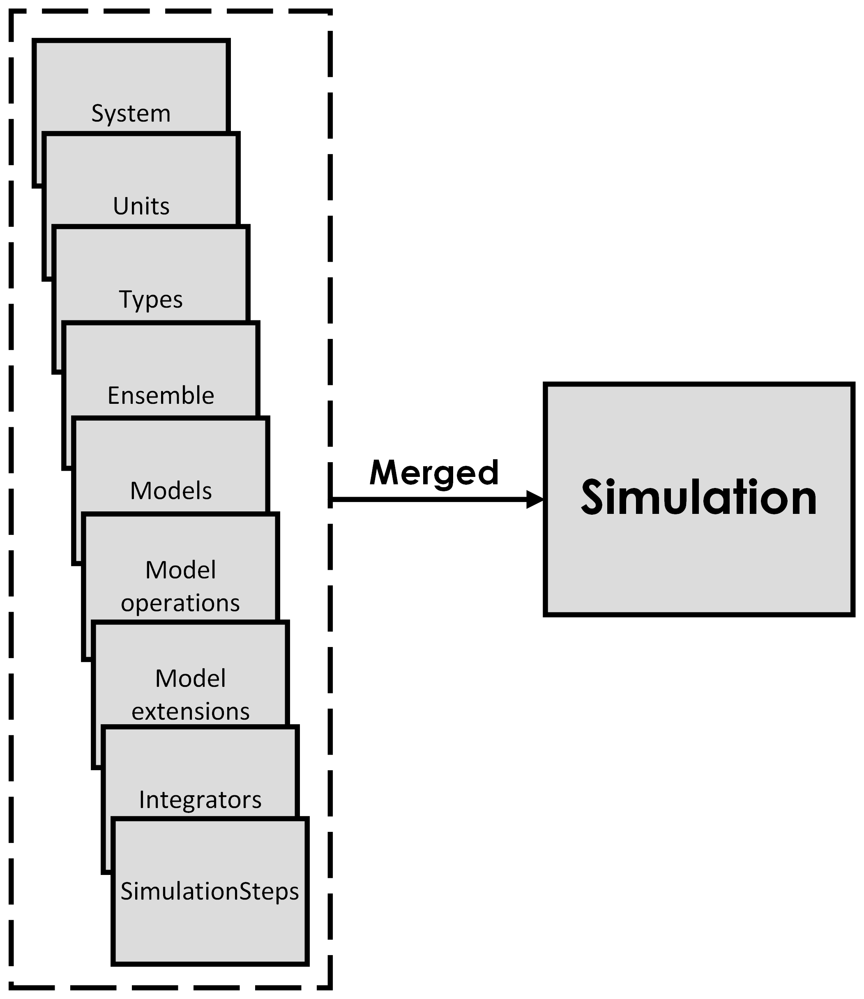
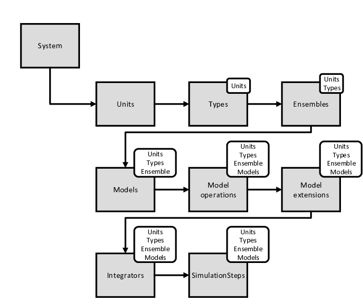

Simulation
==========

A simulation in VLMP is composed of various components. To specify a simulation, we list all the components we wish to use, 
categorized by their functions. VLMP has nine possible categories, each related to a different aspect of the simulation. 
Some categories are mandatory, while others are optional depending on the needs of the simulation. 
The available categories and the types of information they add to the simulation are the following:

- **System** (Mandatory): Components in the 'System' category are used to set elements somewhat external to the simulation itself, 
  like technical aspects including backup management or behavior in case of errors. 
  'System' is the only category that contains a mandatory component for the simulation, known as 'simulationName', 
  which provides a unique alias for each simulation.

- **Units** (Mandatory): In the 'Units' category, we select the unit system to be used. 
  Choosing a unit system sets the value of certain physical constants like the Coulomb and Boltzmann constants. 
  These constants are also accessible to other components, 
  allowing them to be aware of the unit system and the value of physical constants. 
  'Units' is unique in that it accepts only one component, as working with more than one unit system has no sense. 
  An example of a 'Units' type component is 'none', where all relevant physical constants take a unit value.

- **Types** (Mandatory): The 'Types' category indicates what information will be available for the particles. 
  For example, using the 'basic' component implies that particles have defined properties like mass, radius, and charge. 
  This category also accepts only one component and is accessible to other components.

- **Ensembles** (Mandatory): The 'Ensembles' category accepts a single component that sets the ensemble for the simulation, 
  such as 'NVT', indicating a constant number of particles, volume, and temperature. 
  The chosen ensemble component is available to other components, informing them of the simulation box size, for example.

- **Models** (Mandatory): The 'Models' category is central to VLMP. It specifies the different physical systems to be simulated, 
  such as coarse-grained models of proteins, DNA, viruses, patchy particles, etc. 
  Models are responsible for adding particles and interactions to the simulation. 
  There is no maximum number of components in this category, the different models added will be combined together by VLMP.

- **Model Operations** (Optional): The 'Model Operations' category, where components modify the positions of particles in the models, 
  is optional. For instance, if a protein and a DNA strand are added, 
  components in this category can adjust their positions to avoid overlap at the start of the simulation.

- **Model Extensions** (Optional): This category includes components that modify models without adding new particles. 
  Examples include adding potentials for protein-DNA interactions or fixing the center of mass of a group of particles.

- **Integrators** (Mandatory): Integrators are responsible for the temporal evolution of the simulation. 
  VLMP offers various integrators, from Verlet for NVE to NVT integrators like Langevin or Brownian.

- **Simulation Steps** (Optional): Using the above components, we specify the simulation we wish to conduct. 
  However, none of the mentioned components perform any function to extract information from the simulation. 
  This is achieved through 'Simulation Step' components, which perform operations at certain intervals during the simulation. 
  These operations can include writing particle positions to a file or measuring quantities like temperature or stress.

   The different components are merged to create a simulation

Order
^^^^^

Both categories and components within VLMP are processed in order. 
It is important to note a key characteristic about the categories of components: the components of each category are indicated in a list. 
Lists are ordered data sets, and VLMP assumes this order, so the user can always assume that 
if one component appears after another in the list of a category, 
the previous components have been processed when the last one is being evaluated. 
This can be used in the construction of the simulation. For instance, if we first add a protein model, 
we can later add an interaction model and examine the previously added model to evaluate if the interaction model is compatible.
When constructing a simulation, the different categories are processed in the following order:

   The order in which different categories are processed. A small box has been added to each category. This box indicates the information available when the current category is processed.

